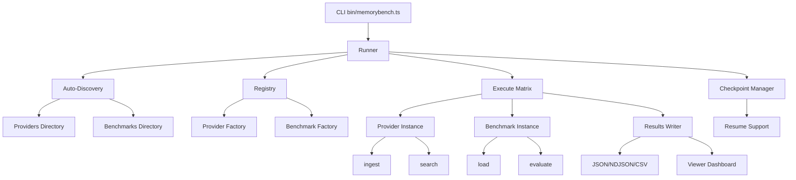

# MemoryBench Architecture

## Overview

MemoryBench is a unified benchmarking platform for memory providers. It uses auto-discovery to find providers and benchmarks, executes them in a matrix, and collects standardized results.

## Architecture Diagram



## Component Overview

### CLI (`bin/memorybench.ts`)

Entry point for all commands:
- `run` / `eval` - Execute benchmarks
- `list` - Show discovered providers/benchmarks
- `view` - Start visualization dashboard
- `ci` - CI mode with regression detection

### Runner (`runner/`)

Core orchestration:
- **index.ts** - Main run function, coordinates execution
- **discovery.ts** - Auto-discovers providers and benchmarks
- **registry.ts** - Manages provider/benchmark factories
- **checkpoint.ts** - Handles resume from failures
- **defaults.ts** - Auto-detection logic
- **output.ts** - Progress bars and formatting
- **types.ts** - Type definitions

### Providers (`providers/`)

Memory system implementations:
- **types.ts** - Provider interface and legacy adapter
- **mock/** - In-memory TF-IDF provider
- **supermemory/** - Supermemory API provider
- **memzero/** - MemZero API provider
- **aqrag/** - AQRAG with PostgreSQL
- **contextualretrieval/** - Contextual Retrieval with PostgreSQL

### Benchmarks (`benchmarks/`)

Test case definitions:
- **types.ts** - Benchmark interface and helpers
- **quicktest/** - Fast 10-question benchmark
- **LoCoMo/** - Long-form conversation benchmark
- **RAG-template-benchmark/** - RAG Q&A pairs
- **LongMemEval/** - Session-based benchmark (separate scripts)

### Results (`results/`)

Results management:
- **schema.ts** - Zod-validated schema
- **writer.ts** - File I/O (JSON, NDJSON, CSV, Markdown)
- **comparator.ts** - Compare runs for regression detection

### Viewer (`viewer/`)

Web dashboard:
- **server.ts** - Bun HTTP server with API
- **frontend.tsx** - React dashboard
- **styles.css** - Styling

## Data Flow

1. **Discovery Phase**
   - Scan `providers/` and `benchmarks/` directories
   - Load modules that export `meta` and `create*` functions
   - Register in registry

2. **Execution Phase**
   - For each benchmark × provider combination:
     - Load test cases from benchmark
     - Reset provider state
     - For each test case:
       - Ingest contexts into provider
       - Search with query
       - Evaluate results
       - Save checkpoint

3. **Results Phase**
   - Aggregate metrics (accuracy, latency, scores)
   - Write to file (JSON/NDJSON/CSV)
   - Optionally start viewer server

## Auto-Discovery Mechanism

Providers and benchmarks are automatically discovered by:
1. Scanning directory (`providers/` or `benchmarks/`)
2. Loading `index.ts` (or `benchmark.ts` for LoCoMo)
3. Checking for `meta` export (ProviderMeta or BenchmarkMeta)
4. Finding `create*Provider()` or `create*Benchmark()` function
5. Registering in registry

**Example Provider:**
```typescript
export const meta: ProviderMeta = {
  name: "myprovider",
  description: "My provider",
  requiresEnv: ["API_KEY"],
};

export function createMyProvider(): Provider {
  return { name: "myprovider", ingest, search };
}
```

**Example Benchmark:**
```typescript
export const meta: BenchmarkMeta = {
  name: "mybenchmark",
  description: "My benchmark",
  testCaseCount: 10,
};

export function createMyBenchmark(): Benchmark {
  return { name: "mybenchmark", load, evaluate };
}
```

## Checkpointing

Checkpoints enable resuming interrupted runs:
- Saved after each test case
- Stored in `.memorybench/checkpoint.json`
- Contains: completed results, current progress, resume point
- Automatically detected on next run
- Use `--restart` to ignore checkpoint

## Legacy Compatibility

Legacy providers (AQRAG, ContextualRetrieval) use the `LegacyProvider` interface:
- `addContext()` → `ingest()`
- `searchQuery()` → `search()`
- `prepareProvider()` → handled by adapter

The `adaptLegacyProvider()` function converts legacy providers to the new interface.

## Extension Points

### Adding a Provider

1. Create `providers/YOUR_NAME/index.ts`
2. Export `meta: ProviderMeta`
3. Export `createYourNameProvider(): Provider`
4. Auto-discovered!

### Adding a Benchmark

1. Create `benchmarks/YOUR_NAME/index.ts`
2. Export `meta: BenchmarkMeta`
3. Export `createYourNameBenchmark(): Benchmark`
4. Auto-discovered!

See [CONTRIBUTING.md](CONTRIBUTING.md) for detailed examples.

